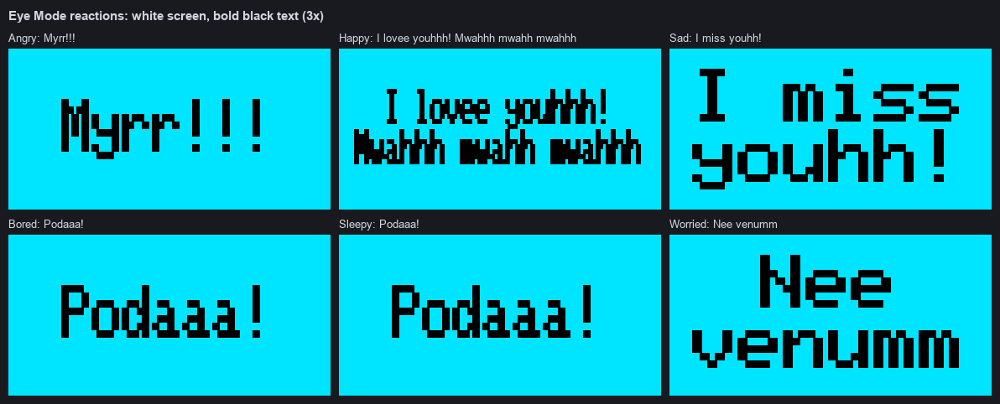
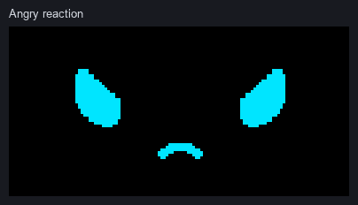

<div align="center">


<samp><b>OLED EYE ANIMATION</b></samp>

<samp>esp32 · ssd1306 · arduino · embedded systems</samp>

</div>

---

<div align="center"><samp>An ESP32-based OLED project with videos, still images, an animated robot face, a mood-driven Eye Mode with button reactions, and two-button control.</samp></div>

---

<div align="center"><samp><b>Features</b></samp></div>

- <samp><b>Video and image playback</b> — 4 animated videos stored as bitmap frames and 6 still images.</samp>
- <samp><b>Animated robot face</b> — 11 emotions drawn live with Adafruit GFX (no per-frame bitmaps), each with its own animation.</samp>
- <samp><b>Eye Mode</b> — emotions are picked automatically with weighted randomness; the same emotion never repeats twice in a row.</samp>
- <samp><b>Button reactions</b> — in Eye Mode, PREV/NEXT clicks count toward a random 1–5 threshold; six emotions then type a message on a white screen.</samp>
- <samp><b>Two-button control</b> — PREV and NEXT browse content in Normal Mode; both buttons together switch modes.</samp>
- <samp><b>Responsive animation</b> — non-blocking <code>millis()</code> timing, no <code>delay()</code>, so the buttons stay responsive.</samp>

---

<div align="center"><samp><b>Hardware</b></samp></div>

| <samp>Part</samp> | <samp>Connection</samp> | <samp>ESP32</samp> |
|---|---|---|
| <samp>SSD1306 OLED 128×64</samp> | <samp>VCC</samp> | <samp>3V3</samp> |
| <samp>SSD1306 OLED 128×64</samp> | <samp>GND</samp> | <samp>GND</samp> |
| <samp>SSD1306 OLED 128×64</samp> | <samp>SDA</samp> | <samp>GPIO 22</samp> |
| <samp>SSD1306 OLED 128×64</samp> | <samp>SCL</samp> | <samp>GPIO 21</samp> |
| <samp>PREV button</samp> | <samp>one leg</samp> | <samp>GPIO 25</samp> |
| <samp>PREV button</samp> | <samp>other leg</samp> | <samp>GND</samp> |
| <samp>NEXT button</samp> | <samp>one leg</samp> | <samp>GPIO 26</samp> |
| <samp>NEXT button</samp> | <samp>other leg</samp> | <samp>GND</samp> |

<samp><b>OLED address:</b> <code>0x3C</code>. Buttons use <code>INPUT_PULLUP</code>, so a pressed button reads <code>LOW</code>. This project intentionally uses <code>SDA = GPIO 22</code> and <code>SCL = GPIO 21</code> via <code>Wire.begin(22, 21)</code>.</samp>

---

<div align="center"><samp><b>Modes</b></samp></div>

<samp><b>Normal Mode</b></samp>

- <samp>Starts with the first video.</samp>
- <samp>PREV and NEXT browse the 4 videos and 6 images (the eye emotions are not part of this list).</samp>
- <samp>Videos loop at their configured frame rate; images stay until you navigate.</samp>

<samp><b>Eye Mode</b></samp>

- <samp>Press PREV and NEXT together to enter.</samp>
- <samp>An emotion is selected immediately using the mood weights and animates at about 30 FPS.</samp>
- <samp>After a random time within that emotion's range, another emotion is selected — never the same one twice in a row.</samp>
- <samp>PREV/NEXT never change the emotion. Single presses only count toward the reaction threshold (see <b>Reactions</b>).</samp>

<samp><b>Exit</b></samp>

- <samp>Press both buttons together again — also while a reaction is showing — to return to the exact video or image that was displayed before. A video resumes from its previous frame.</samp>

---

<div align="center"><samp><b>Emotions</b></samp></div>

| <samp>#</samp> | <samp>Name</samp> | <samp>Animation</samp> | <samp>Weight</samp> | <samp>Time</samp> |
|---:|---|---|---:|---|
| <samp>1</samp> | <samp>Happy</samp> | <samp>∩ eyelids over small lower pieces, bean smile; gentle bounce, mouth pulse</samp> | <samp>14</samp> | <samp>4–8 s</samp> |
| <samp>2</samp> | <samp>Sad</samp> | <samp>Eyes droop outward over lower pieces; slow sinking, small tear, slow blinks, frown</samp> | <samp>3</samp> | <samp>5–8 s</samp> |
| <samp>3</samp> | <samp>Angry</samp> | <samp>Tilted eyes, inner edges cut toward the centre; creep inward and tremble</samp> | <samp>4</samp> | <samp>3.5–6 s</samp> |
| <samp>4</samp> | <samp>Sleepy</samp> | <samp>Thin curved eyelids that close, a floating "z" and a tiny snore, then reopen</samp> | <samp>5</samp> | <samp>6–10 s</samp> |
| <samp>5</samp> | <samp>Surprised</samp> | <samp>Eyes stretch taller with an overshoot; small open mouth</samp> | <samp>2</samp> | <samp>2.5–4.5 s</samp> |
| <samp>6</samp> | <samp>Worried</samp> | <samp>Taller, uneven eyes that quiver and glance around; wobbly mouth</samp> | <samp>3</samp> | <samp>4–7 s</samp> |
| <samp>7</samp> | <samp>Confused</samp> | <samp>One taller eye and one small tilted eye that keep changing; tilted mouth; "?"</samp> | <samp>5</samp> | <samp>4–7 s</samp> |
| <samp>8</samp> | <samp>Excited</samp> | <samp>Wider eyes bouncing fast and pulsing; D-shaped grin; sparkles</samp> | <samp>8</samp> | <samp>3–6 s</samp> |
| <samp>9</samp> | <samp>Bored</samp> | <samp>Very flat half-lidded eyes drifting sideways; long slow blinks; flat mouth</samp> | <samp>5</samp> | <samp>5–9 s</samp> |
| <samp>10</samp> | <samp>Scared</samp> | <samp>Small eyes set wide apart; trembling, darting, fast blinks; tiny mouth</samp> | <samp>2</samp> | <samp>3–5 s</samp> |
| <samp>11</samp> | <samp>Furious</samp> | <samp>Strongly angled eyes, inner edges cut hard; hard shaking, anger mark, jagged mouth</samp> | <samp>2</samp> | <samp>3–5 s</samp> |

<samp>The weights total 53. A higher weight makes an emotion more likely to be picked (before the no-repeat rule).</samp>

---

<div align="center"><samp><b>Reactions</b></samp></div>

<samp>In Eye Mode every single PREV or NEXT press adds to one shared click counter. A random threshold of 1–5 clicks (<code>random(1, 6)</code>, ESP32 hardware RNG) is chosen when Eye Mode starts and again after every reaction or reset. When the counter reaches it:</samp>

| <samp>Emotion</samp> | <samp>Reaction text</samp> |
|---|---|
| <samp>Angry</samp> | <samp><b>Myrr!!!</b></samp> |
| <samp>Happy</samp> | <samp><b>I lovee youhhh!</b> / <b>Mwahhh mwahh mwahhh</b></samp> |
| <samp>Sad</samp> | <samp><b>I miss youhh!</b></samp> |
| <samp>Worried</samp> | <samp><b>Nee venumm</b></samp> |
| <samp>Bored</samp> | <samp><b>Podaaa!</b></samp> |
| <samp>Sleepy</samp> | <samp><b>Podaaa!</b></samp> |

- <samp>The eyes stop and the whole screen turns white. No eyes, icons or other graphics are shown.</samp>
- <samp>The message is typed in bold black text, one character about every 70 ms, held for about 1.6 s, then the <b>same</b> emotion resumes (no new random pick).</samp>
- <samp>Text is centred and uses the largest size that fits inside a 4 px margin (measured with <code>getTextBounds()</code>, words are never split).</samp>
- <samp>Presses during a reaction are ignored. Both buttons together still exit Eye Mode immediately.</samp>
- <samp>For Surprised, Confused, Excited, Scared and Furious, reaching the threshold just resets the counter with a new random threshold — no text.</samp>

---

<div align="center"><samp><b>Eye Design</b></samp></div>

<samp>The face is a compact animated robot character whose style was <b>inspired by</b> an <a href="https://www.oledanimationmaker.com/?s=DBdtgyEY6vSbQFSxpzuu">OLED Animation Maker reference</a>. It is an original implementation, not a copy of that animation.</samp>

- <samp>One curved eye shape (<code>rfEye()</code>): a superellipse between an oval and a rounded rectangle — curved, slightly flattened top and bottom, short straighter sides, never a perfect circle.</samp>
- <samp>Emotions deform that same shape: stretched, squashed, tilted, or cut by curved upper/lower lids (∩ eyelids, thin slits, drooping or angry tilts).</samp>
- <samp>The whole face is drawn at 140% of the base design, with eyes kept narrow (72% width), and every animation frame stays inside the 128×64 screen.</samp>
- <samp>Small extras: mouths and lower pieces from smooth thick arcs, a tear, "z", "?", sparkles and an anger mark.</samp>

---

<div align="center"><samp><b>Previews</b></samp></div>






<div align="center"><samp>Previews are rendered on a PC from the same shapes and integer math as <code>EyeVariants.h</code>. Lit OLED pixels are shown in cyan, so the white reaction background appears cyan. The physical 128×64 OLED may differ by a few pixels.</samp></div>

---

<div align="center"><samp><b>Button Behavior</b></samp></div>

| <samp>Input</samp> | <samp>Normal Mode</samp> | <samp>Eye Mode</samp> |
|---|---|---|
| <samp>PREV</samp> | <samp>Previous video/image</samp> | <samp>Reaction click (never changes the emotion)</samp> |
| <samp>NEXT</samp> | <samp>Next video/image</samp> | <samp>Reaction click (never changes the emotion)</samp> |
| <samp>PREV + NEXT</samp> | <samp>Enter Eye Mode</samp> | <samp>Exit to the same video/image</samp> |

<samp><b>Debounce:</b> 30 ms stable input.</samp>

<samp><b>Combination window:</b> up to 80 ms for detecting a simultaneous press; a simultaneous press always has priority and is never counted as a click.</samp>

<samp><b>Single-button repeat:</b> at most one single PREV/NEXT action every 200 ms.</samp>

<samp>Holding both buttons switches mode only once, until both buttons are released.</samp>

---

<div align="center"><samp><b>Software</b></samp></div>

- <samp>Arduino IDE</samp>
- <samp>ESP32 Arduino core — checked against version 2.0.17</samp>
- <samp>Adafruit SSD1306</samp>
- <samp>Adafruit GFX Library</samp>
- <samp>Adafruit BusIO</samp>
- <samp>Wire / I2C</samp>

<samp>All drawing uses Adafruit GFX. The <code>esp32-eyes-main/</code> folder is kept only as reference material; it is not compiled or used.</samp>

---

<div align="center"><samp><b>Project Structure</b></samp></div>

```text
oled-project/
├── v3.ino                         Main sketch: content data, modes, buttons, mood selection, reactions
├── EyeVariants.h                  11 emotions: curved eye geometry, animations, frame timing
├── README.md                      Project documentation
├── docs/
│   ├── eye-emotions-sheet.png     All emotions (actual size and 3x)
│   ├── eye-mode-preview.gif       Emotions animating
│   ├── eye-reactions-preview.png  Reaction screens
│   └── eye-reactions-preview.gif  Reactions animated
├── v4/                            Separate, isolated v4 sketch (see v4/README.md)
└── esp32-eyes-main/               Reference copy of esp32-eyes (not compiled)
```

<samp>All video and image bitmap data is stored in <code>v3.ino</code> as <code>PROGMEM</code> arrays.</samp>

---

<div align="center"><samp><b>Installation</b></samp></div>

<samp><b>1. Get the code</b></samp>

```bash
git clone https://github.com/yo5on/oled-project.git v3
```

<samp>The Arduino IDE expects the sketch folder name to match the <code>.ino</code> filename. Cloning into <code>v3</code> keeps <code>v3.ino</code> in the correct folder.</samp>

<samp><b>2. Open the sketch</b></samp>

<samp>Open <code>v3/v3.ino</code> in Arduino IDE. Keep <code>EyeVariants.h</code> in the same folder.</samp>

<samp><b>3. Install ESP32 support</b></samp>

<samp>Use Boards Manager to install <b>esp32 by Espressif Systems</b>.</samp>

<samp><b>4. Install libraries</b></samp>

<samp>Use Library Manager to install <b>Adafruit SSD1306</b> and its dependencies.</samp>

<samp><b>5. Select the board</b></samp>

<samp><b>Tools → Board → esp32 → ESP32 Dev Module</b></samp>

<samp><b>6. Select the port</b></samp>

<samp>Choose the COM port connected to the ESP32.</samp>

<samp><b>7. Upload</b></samp>

<samp>If upload stalls at <code>Connecting...</code>, hold the board's <b>BOOT</b> button while the upload starts.</samp>

<samp><b>8. Test</b></samp>

- <samp>Open Serial Monitor at <b>115200</b> baud and check for <code>OLED READY</code>.</samp>
- <samp>Press NEXT and PREV to verify content navigation.</samp>
- <samp>Press both buttons together and check for <code>EYE MODE</code> and <code>Eye Mode: &lt;name&gt;</code>.</samp>
- <samp>Click PREV/NEXT on Angry, Happy, Sad, Worried, Bored or Sleepy and check for <code>Eye Mode reaction: ...</code>.</samp>

---

<div align="center"><samp><b>Usage</b></samp></div>

1. <samp>Power on. Normal Mode starts on Video 1.</samp>
2. <samp>Use PREV/NEXT to cycle through 4 videos and 6 images.</samp>
3. <samp>Press both buttons to enter Eye Mode; emotions change automatically.</samp>
4. <samp>Click PREV/NEXT to poke the face; after a random 1–5 clicks, some emotions type a reaction.</samp>
5. <samp>Press both buttons again to return to the same video or image.</samp>

---

<div align="center"><samp><b>Current Content</b></samp></div>

| <samp>Content</samp> | <samp>Count</samp> | <samp>Defined in</samp> |
|---|---:|---|
| <samp>Videos</samp> | <samp>4</samp> | <samp><code>v3.ino</code>, <code>contents[]</code></samp> |
| <samp>Images</samp> | <samp>6</samp> | <samp><code>v3.ino</code>, <code>contents[]</code></samp> |
| <samp>Emotions</samp> | <samp>11</samp> | <samp><code>EyeVariants.h</code>, <code>EyeVariantId</code> / <code>eyeVariants[]</code></samp> |

<samp><b>Normal Mode order:</b> <code>video1 → video4 → video3 → video2 → image1 → image2 → image3 → image4 → image5 → image7</code></samp>

| <samp>Video</samp> | <samp>Frame time</samp> | <samp>Approx. FPS</samp> |
|---|---:|---:|
| <samp><code>video1</code></samp> | <samp>91 ms</samp> | <samp>~11</samp> |
| <samp><code>video4</code></samp> | <samp>66 ms</samp> | <samp>~15</samp> |
| <samp><code>video3</code></samp> | <samp>149 ms</samp> | <samp>~6.7</samp> |
| <samp><code>video2</code></samp> | <samp>200 ms</samp> | <samp>5</samp> |

---

<div align="center"><samp><b>Troubleshooting</b></samp></div>

| <samp>Problem</samp> | <samp>What to check</samp> |
|---|---|
| <samp>OLED stays blank</samp> | <samp>Verify SDA = GPIO 22, SCL = GPIO 21, VCC = 3V3, GND = GND.</samp> |
| <samp>SSD1306 allocation failed</samp> | <samp>Check power, wiring, and I2C address <code>0x3C</code>.</samp> |
| <samp>Wrong I2C address</samp> | <samp>The sketch uses <code>0x3C</code>. Some modules use <code>0x3D</code>.</samp> |
| <samp>Buttons do not respond</samp> | <samp>Connect each button between its GPIO and GND. Buttons use <code>INPUT_PULLUP</code>.</samp> |
| <samp>Eye Mode will not start</samp> | <samp>Press both buttons within about 80 ms of each other.</samp> |
| <samp>No reaction text</samp> | <samp>Only Angry, Happy, Sad, Worried, Bored and Sleepy react, and only after the random 1–5 clicks.</samp> |
| <samp>Upload hangs at Connecting...</samp> | <samp>Hold BOOT while uploading and verify the COM port and USB cable.</samp> |
| <samp>Compile errors about missing headers</samp> | <samp>Install Adafruit SSD1306 and its dependencies, select an ESP32 board, and keep EyeVariants.h beside v3.ino.</samp> |
| <samp>Sketch too big</samp> | <samp>The bitmap data uses about 600 KB of flash. Use a larger app partition if you add more content.</samp> |

---

<div align="center"><samp><b>Development Notes</b></samp></div>

| <samp>Area</samp> | <samp>Implementation</samp> |
|---|---|
| <samp>Pins and OLED</samp> | <samp><code>v3.ino</code>: <code>BTN_PREV</code>, <code>BTN_NEXT</code>, <code>SCREEN_ADDR</code>, <code>Wire.begin(22, 21)</code></samp> |
| <samp>Content</samp> | <samp><code>contents[]</code>, <code>videoFrameMs[]</code>, <code>PROGMEM</code> bitmap arrays</samp> |
| <samp>Normal navigation</samp> | <samp><code>nextContent()</code>, <code>previousContent()</code> (skip <code>EYES</code> slots), <code>playContent()</code></samp> |
| <samp>Emotions</samp> | <samp><code>EyeVariantId</code>, <code>eyeVariants[]</code>, <code>rfDrawEmotion()</code> in <code>EyeVariants.h</code></samp> |
| <samp>Eye geometry</samp> | <samp><code>rfEye()</code>, <code>rfLids()</code>, <code>rfArc()</code>, <code>rfStroke()</code>; size via <code>RF_SCALE</code> (140) and <code>RF_EYE_NARROW</code> (72)</samp> |
| <samp>Animation timing</samp> | <samp><code>drawEyeFrame()</code>, <code>eyeAnimRestart()</code>, <code>eyeAnimUpdate()</code> (~33 ms per frame)</samp> |
| <samp>Mood selection</samp> | <samp><code>eyeMoods[]</code>, <code>pickRandomEye()</code>, <code>autoSelectEye()</code>, <code>updateEyeAnimation()</code></samp> |
| <samp>Reactions</samp> | <samp><code>handleEyeModePress()</code>, <code>newReactThreshold()</code>, <code>startReaction()</code>, <code>layoutReaction()</code>, <code>drawReaction()</code>, <code>updateReaction()</code></samp> |
| <samp>Modes</samp> | <samp><code>Mode</code>, <code>enterEyeMode()</code>, <code>exitEyeMode()</code>, <code>loop()</code></samp> |
| <samp>Buttons</samp> | <samp><code>DebouncedButton</code>, <code>updateButton()</code>, <code>singlePressReady()</code>, <code>handleButtons()</code></samp> |

<samp>When adding or removing an emotion, keep <code>EyeVariantId</code>, <code>eyeVariants[]</code>, the matching <code>case</code> in <code>rfDrawEmotion()</code>, <code>eyeMoods[]</code> and the <code>EYES</code> slots in <code>contents[]</code> in the same order. Compile-time checks catch length mismatches.</samp>

---

<div align="center"><samp><b>License</b></samp></div>

<samp>The robot-face eye graphics and animations in <code>EyeVariants.h</code> are original to this project; their style was inspired by the OLED Animation Maker reference linked above. An earlier version of the eyes was derived from <a href="https://github.com/playfultechnology/esp32-eyes">esp32-eyes</a> by Alastair Aitchison (Playful Technology) and Luis Llamas (AGPL-3.0); that library remains in <code>esp32-eyes-main/</code> for reference with its license in <code>esp32-eyes-main/LICENSE</code>, but it is no longer compiled or used.</samp>

<div align="center"><samp><b>Author</b></samp></div>

<div align="center">
<samp><strong>Yoson</strong></samp>

<samp>Embedded systems, robotics, and hardware projects.</samp>
</div>
