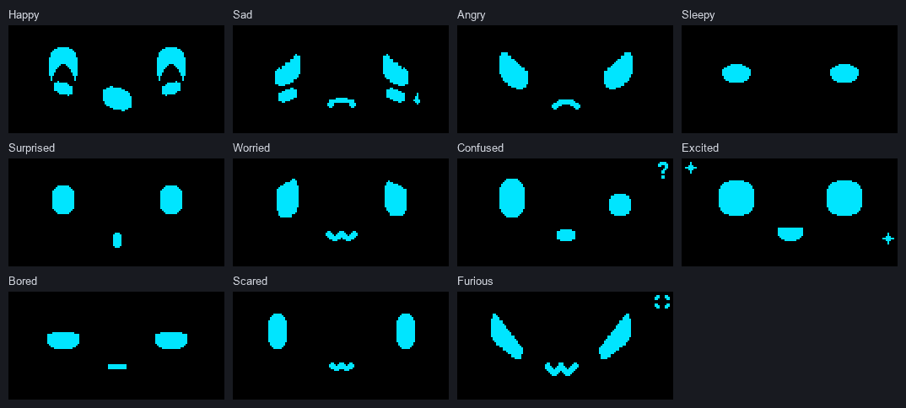

# OLED Eye Animation Project

## Overview

An ESP32 project that drives a 0.96" 128x64 SSD1306 OLED and is controlled with two push buttons. It has:

- **4 animated videos** stored as 1024-byte bitmap frames
- **6 still images**
- **13 animated eye expressions**, drawn live from shape settings rather than stored as bitmaps
- an autonomous, mood-based **Eye Mode** that picks expressions by itself
- **two buttons**: PREV and NEXT for browsing, and both together to switch modes

The eye drawing and animation code is ported from the [esp32-eyes](https://github.com/playfultechnology/esp32-eyes) library (AGPL-3.0), which is included in `esp32-eyes-main/` for reference.

## Hardware

- ESP32 DevKit (30-pin)
- 0.96" 128x64 SSD1306 OLED, I2C
- 2 momentary push buttons

| Part | Pin | ESP32 |
|---|---|---|
| OLED | VCC | 3V3 |
| OLED | GND | GND |
| OLED | SDA | **GPIO 22** |
| OLED | SCL | **GPIO 21** |
| PREV button | one leg | **GPIO 25** |
| PREV button | other leg | GND |
| NEXT button | one leg | **GPIO 26** |
| NEXT button | other leg | GND |

- **OLED I2C address:** `0x3C`.
- **Buttons:** use the ESP32's internal pull-ups (`INPUT_PULLUP`), so no external resistors are needed. A pressed button reads `LOW`.
- **Swapped I2C pins:** this project sets SDA = GPIO 22 and SCL = GPIO 21 with `Wire.begin(22, 21)`. That's the reverse of the ESP32's usual default (SDA 21, SCL 22), so wire it as shown in the table.

## Modes

### Normal Mode

The ESP32 starts in Normal Mode, on the first video.

- **GPIO 25 (PREV):** previous item.
- **GPIO 26 (NEXT):** next item.
- **What it cycles through:** only the 4 videos and 6 images, wrapping around at either end. Eye expressions never appear here.
- **Videos** loop continuously at their own frame rate. **Images** stay on screen.

### Eye Mode

- **Enter:** press **both buttons at the same time**.
- **First expression:** chosen automatically as soon as Eye Mode starts.
- **Selection:** expressions are picked at random using a mood weight table, so common moods appear more often than rare ones (see [Eye Expressions](#eye-expressions)).
- **No manual control:** PREV and NEXT don't change the expression in Eye Mode. Single presses are ignored.
- **Animation:** the current expression animates continuously, at about 30 frames per second.
- **Switching:** after a random time within that expression's range, a new one is picked and its animation starts from the beginning. The same expression is never picked twice in a row.

### Exiting Eye Mode

- Press **both buttons at the same time** again.
- The display returns to the same video or image that was showing before Eye Mode, and a video continues from the frame it was on.
- Exiting never moves to the next or previous item.

## Eye Expressions

These are the 13 expressions in the `eyeVariants[]` table in `EyeVariants.h`. The animation descriptions come from the `eyeAnims[]` table, and the weights and times from `eyeMoods[]` in `v3.ino`.

| # | Name | Animation | Weight | Time on screen |
|---|---|---|---|---|
| 1 | Neutral | Gentle breathing (slight size pulse) and a natural blink every 3.5 s | 20 | 5–10 s |
| 2 | Blink (high) | Looking up; eyes open → half closed → closed → half closed → open, repeating | 8 | 2.5–4 s |
| 3 | Glee | Bouncing up and down | 10 | 3–6 s |
| 4 | Sad (looking up to user) | Looking up with a pleading quiver, and blinking | 3 | 4–7 s |
| 5 | Worried | Nervous left/right glances and a quiver, with blinking | 3 | 4–7 s |
| 6 | Focused/Determined | Slow narrowing pulse, with a rare blink | 5 | 4–8 s |
| 7 | Annoyed | Glances away and back, with a slow blink | 4 | 4–7 s |
| 8 | Frustrated/Bored | Wanders around in several directions, with a slow blink | 4 | 4–7 s |
| 9 | Sleepy Eyes | Drooping lids with a slow, heavy blink | 5 | 5–9 s |
| 10 | Suspicious | Shifty left/right look, with blinking | 6 | 4–7 s |
| 11 | Angry | Small up/down jitter, with blinking | 4 | 3–6 s |
| 12 | Scared | Trembling with darting side looks, and quick blinks | 2 | 3–5 s |
| 13 | Awe | Slow "wonder" pulse looking slightly up, with blinking | 2 | 3–6 s |

A higher weight means the expression is picked more often. The weights add up to 76, so before the no-repeat rule Neutral is picked about 26% of the time, and Scared or Awe about 3%.

## Eye Mode Preview



*Animated preview of the eye variants used by Eye Mode.*

The preview shows the 13 eye expressions available in Eye Mode, all animating side by side for about 6 seconds. On the device, only one expression is shown at a time:

1. **Enter:** press **both buttons** together.
2. **Automatic selection:** Eye Mode picks an expression at random using the mood weights above.
3. **Continuous animation:** the expression animates using the system in `EyeVariants.h` (`eyeAnims[]`, `drawEyeFrame()`), which combines breathing or pulsing, blinking and look direction.
4. **Switching:** after a random time it switches to a different expression, never the same one twice in a row.
5. **Exit:** press **both buttons** again to return to the video or image you were on.

The preview was rendered in software with the same shapes and animation values as `EyeVariants.h`. The real 128×64 OLED may differ by a few pixels.

## Button Behavior

- **Debounce:** each button must read the same for 30 ms before a press or release counts.
- **Simultaneous press:** a single press waits up to 80 ms (or until you release, if sooner) to see whether the other button follows. If both are down together, it's treated as a both-button press and neither single action fires.
- **Both buttons:** switches between Normal Mode and Eye Mode.
- **Holding:** holding both buttons switches mode only once. Nothing else happens until both are released, and releasing or re-pressing one button while the other is still held does nothing.
- **Holding one button:** fires once, not repeatedly. If you then press the other button while still holding the first, it still counts as a both-button press and switches mode.
- **Repeat limit:** single PREV/NEXT actions in Normal Mode are at least 200 ms apart.

| Input | Normal Mode | Eye Mode |
|---|---|---|
| PREV (GPIO 25) | Previous video/image | Ignored |
| NEXT (GPIO 26) | Next video/image | Ignored |
| PREV + NEXT | Enter Eye Mode | Exit to the same video/image |

## Software

- [Arduino IDE](https://www.arduino.cc/en/software)
- **ESP32 Arduino core** (Espressif). Checked against version 2.0.17.
- **Adafruit SSD1306:** drives the OLED.
- **Adafruit GFX Library:** drawing (bitmaps, rectangles, triangles, lines).
- **Adafruit BusIO:** a dependency of the two Adafruit libraries. The Library Manager installs it automatically.
- **Wire:** I2C. Built into the ESP32 core.

The sketch doesn't use the `esp32-eyes` library at build time. Its drawing code was copied into `EyeVariants.h` and adapted for Adafruit GFX, so U8g2 isn't needed.

## Project Structure

```
oled-project/
├── v3.ino              Main sketch: video/image bitmaps, content table, modes,
│                       buttons, Eye Mode mood selection
├── EyeVariants.h       13 eye expressions: presets, drawing, animation
├── README.md           This file
├── docs/
│   └── eye-mode-preview.gif   Animated preview of the eye expressions (used in this README)
└── esp32-eyes-main/    Original esp32-eyes library (AGPL-3.0), reference only, not compiled
    ├── LICENSE
    ├── README.md
    ├── esp32-eyes.ino
    ├── *.h / *.cpp / *.hpp   (Face, Eye, EyeDrawer, EyePresets, animations, ...)
    └── doc/            Reference images and diagrams
```

All video and image data is inside `v3.ino` as `PROGMEM` arrays (`video1_frame0` …, `image1` …). There are no separate content files.

## Installation

1. **Get the code:**
   ```bash
   git clone https://github.com/yo5on/oled-project.git v3
   ```
   The Arduino IDE needs the folder to have the same name as the `.ino` file. Cloning into a folder named `v3`, as above, avoids that problem. If you clone or download it under another name, the IDE will offer to move `v3.ino` into a `v3` folder when you open it; accept that, and copy `EyeVariants.h` into the same folder.
2. **Open the sketch:** open `v3/v3.ino` in the Arduino IDE. `EyeVariants.h` opens as a second tab.
3. **Install the ESP32 core:** in **Boards Manager**, install **esp32 by Espressif Systems**.
4. **Install the libraries:** in **Library Manager**, install **Adafruit SSD1306**, and accept its dependencies (Adafruit GFX Library, Adafruit BusIO).
5. **Select the board:** **Tools → Board → esp32 → ESP32 Dev Module**.
6. **Select the port:** **Tools → Port**, the COM port of your ESP32.
7. **Upload.** If the upload stalls at `Connecting...`, hold the board's **BOOT** button until it starts.
8. **Test:**
   - open **Serial Monitor** at **115200** baud and check for `OLED READY`;
   - press NEXT and PREV and check the content changes;
   - press both buttons and check for `EYE MODE` followed by `Eye Mode: <name>`.

## Usage

1. **Power on:** the OLED starts in Normal Mode, showing Video 1.
2. **NEXT / PREV:** step through the 4 videos and 6 images. Serial shows `Next: <slot>` or `Previous: <slot>`.
3. **Both buttons:** enter Eye Mode. Serial shows `EYE MODE`, and an expression is chosen right away (`Eye Mode: <name>`).
4. **Wait:** the eyes animate continuously and switch to a new mood-weighted expression every few seconds, each logged as `Eye Mode: <name>`. PREV and NEXT do nothing here.
5. **Both buttons again:** Serial shows `NORMAL MODE`, and the display returns to the same video or image as before.

## Troubleshooting

| Problem | What to check |
|---|---|
| OLED stays blank | Wiring: SDA must go to **GPIO 22** and SCL to **GPIO 21**, the reverse of the usual ESP32 default. Power the OLED from 3V3 and GND. |
| Serial shows `SSD1306 allocation failed` | The display didn't start. Check the wiring and the I2C address. |
| Wrong I2C address | The sketch uses `0x3C` (`#define SCREEN_ADDR 0x3C` in `v3.ino`). Some modules use `0x3D`; change the define to match. |
| Buttons don't respond | Each button goes between its GPIO (25 or 26) and **GND**, not 3V3. Check in Serial Monitor for `Next:` / `Previous:`. |
| Eye Mode won't start | Press both buttons within about 80 ms of each other and hold them for a moment. Serial should show `EYE MODE`. |
| PREV/NEXT do nothing | Expected while in Eye Mode. Press both buttons to return to Normal Mode. |
| Eyes don't animate | Check Serial for `Eye Mode: <name>` lines. If they appear but the screen freezes, check the OLED wiring and power. Animation needs no extra setup. |
| Compile errors about missing headers | Install **Adafruit SSD1306** with its dependencies, and select an **ESP32** board, not an AVR/Uno. Keep `EyeVariants.h` in the same folder as `v3.ino`. |
| Upload hangs at `Connecting...` | Hold **BOOT** while the upload starts, and check the COM port and USB cable. |
| `Sketch too big` | The bitmaps take about 600 KB of flash, which fits the default *4MB with spiffs (1.2MB APP)* scheme. If you add content, pick a larger app partition under **Tools → Partition Scheme** (for example *Huge APP*). |

## Current Content

| Content | Count | Defined in |
|---|---|---|
| Videos | 4 (150, 150, 150 and 125 frames) | `v3.ino`, `contents[]` (`VIDEO` slots) |
| Images | 6 | `v3.ino`, `contents[]` (`IMAGE` slots) |
| Eye variants | 13 | `EyeVariants.h`, `EyeVariantId` / `eyeVariants[]` |

Normal Mode order (slots 0–9 of `contents[]`):

| Slot | 0 | 1 | 2 | 3 | 4 | 5 | 6 | 7 | 8 | 9 |
|---|---|---|---|---|---|---|---|---|---|---|
| Item | `video1` | `video4` | `video3` | `video2` | `image1` | `image2` | `image3` | `image4` | `image5` | `image7` |

The names come from the code: the videos were reordered, and the 6th image is named `image7` because the original Image 6 was removed.

| Video | Frame time | Frame rate |
|---|---|---|
| `video1` | 91 ms | ~11 fps |
| `video4` | 66 ms | ~15 fps |
| `video3` | 149 ms | ~6.7 fps |
| `video2` | 200 ms | 5 fps |

## Development Notes

| What | Where |
|---|---|
| Pins and OLED settings | `v3.ino`: `BTN_PREV`, `BTN_NEXT`, `SCREEN_ADDR`, `Wire.begin(22, 21)` in `setup()` |
| Content table | `v3.ino`: `contents[]` (`VIDEO` / `IMAGE` / `EYES` slots); `TOTAL_CONTENT` is calculated from it; video speed per slot in `videoFrameMs[]` |
| Normal navigation | `v3.ino`: `nextContent()` and `previousContent()` (skip `EYES` slots); `playContent()` draws videos and images |
| Eye variants | `EyeVariants.h`: `EyeVariantId` enum, `eyeVariants[]` (name, presets, look, blink) and the `Preset_*` shapes |
| Eye drawing | `EyeVariants.h`: `eyeDraw()` (ported `EyeDrawer::Draw`), `eyeFinalConfig()` |
| Eye animation | `EyeVariants.h`: `eyeAnims[]` (motion, blink timing, look paths), `drawEyeFrame()`, `eyeAnimRestart()`, `eyeAnimUpdate()` (one frame every `EYE_FRAME_MS` = 33 ms) |
| Mood / random selection | `v3.ino`: `eyeMoods[]` (weight, min/max ms), `pickRandomEye()`, `autoSelectEye()`, `updateEyeAnimation()` |
| Modes | `v3.ino`: `enum Mode`, `enterEyeMode()`, `exitEyeMode()`, `loop()` |
| Button handling | `v3.ino`: `DebouncedButton`, `updateButton()`, `singlePressReady()`, `handleButtons()`, `handleNormalModeButtons()`; timing in `stableTime`, `comboWindow`, `debounceTime` |

**Adding or removing an eye expression:** keep `EyeVariantId`, `eyeVariants[]`, `eyeAnims[]` and `eyeMoods[]` in the same order and length. Compile-time checks fail the build if their lengths don't match.

**Timing:** all timing uses `millis()`. There's no `delay()` in the main loop, so the buttons stay responsive while videos play and eyes animate.

## License

The eye drawing and animation code in `EyeVariants.h` is derived from [esp32-eyes](https://github.com/playfultechnology/esp32-eyes) by Alastair Aitchison (Playful Technology) and Luis Llamas, licensed under AGPL-3.0. See `esp32-eyes-main/LICENSE`.
