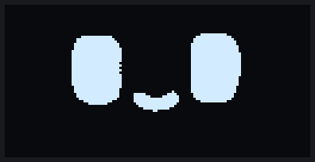
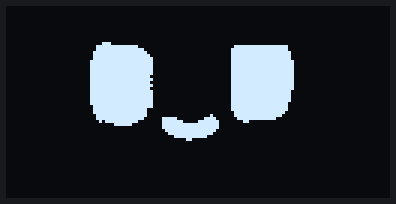
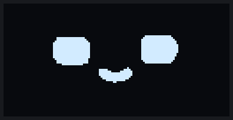
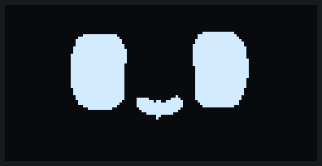
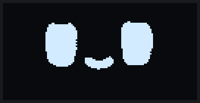
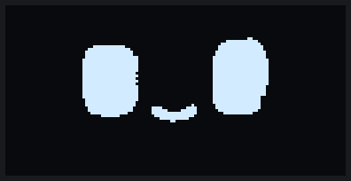
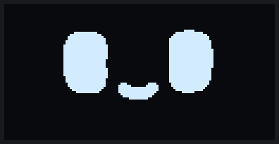

<div align="center">


<samp><b>MOCHI · OLED COMPANION</b></samp>

<samp>esp32 · ssd1306 · arduino · embedded animation</samp>

<br/>



</div>

---

<div align="center"><samp>A tiny animated companion that lives on a 128×64 OLED. Mochi has moods, reacts to two buttons, drifts between expressions with smooth morphs, falls asleep when left alone, and wakes up on its own.</samp></div>

---

## Overview

Mochi is an ESP32 sketch that turns a small SSD1306 OLED into a character with a life of its own. You don't pick animations from a menu. Mochi chooses its own faces based on how it feels, and the two buttons are ways to interact with it: a friendly tap, a poke, or pestering it until it gets cross.

Both buttons together open **Gallery Mode**, which plays photos and short videos on the same screen and then hands the display back to Mochi exactly where it left off.

The repository also keeps the earlier **OLED Eye Animation** sketch, a procedurally drawn robot face, as a separate working project.

## Features

- **Expressive faces.** 40 expressions built from 34 Mochi animations: happy, sad, angry, excited, funny and dramatic.
- **Smooth morphs.** Every change of face is morphed shape by shape. Nothing jumps straight to the next picture.
- **Adaptive transition timing.** Small changes are quick, while large ones take a few more in-between frames.
- **Personality and mood.** Feelings build up over time and set a mood, and the mood decides which faces Mochi picks.
- **Button reactions.** The two buttons do different things, and Mochi remembers how you have been treating it.
- **Sleep and breathing.** When tired and left alone, Mochi dozes off and breathes slowly in its sleep.
- **Natural and manual wake.** It wakes on its own after a while, or right away when you press a button.
- **Gallery Mode.** Browse photos and play looping videos, then go straight back to Mochi.

## Hardware

| Part | Notes |
|---|---|
| ESP32 Dev Module | Arduino core for ESP32 2.0.17 |
| SSD1306 OLED, 128×64, I2C | address `0x3C` |
| 2 × push buttons | to GND, internal pull-ups |

### Wiring

| From | To |
|---|---|
| OLED VCC | 3V3 |
| OLED GND | GND |
| OLED SDA | GPIO 22 |
| OLED SCL | GPIO 21 |
| Button 1 | GPIO 25 → GND |
| Button 2 | GPIO 26 → GND |

### OLED / display

The display runs over I2C with `Wire.begin(22, 21)`. Note that SDA and SCL are deliberately on 22 and 21. Every frame is a full 128×64, 1-bit image (1024 bytes) pushed in one transfer, about 29 ms per frame on the ESP32. Some source clips are stored black-on-white, and the player inverts them in software so every face appears as light on dark.

### ESP32

The animations live in flash as raw or PackBits-compressed frames, and RAM use stays around 105 KB. The public build fits the default partition. The build with your own gallery media needs **Huge APP**, and the sketch stops with a clear compile error if you forget.

### Buttons

Both buttons use `INPUT_PULLUP`, so a press reads `LOW`. Inputs are debounced (30 ms), and a press of both buttons counts as a combo when they land within 150 ms of each other. A combo fires once and waits until both buttons are released, so it never leaks into single presses.

## Mochi expression system

Every expression is a named slice of an animation, such as `SMILE`, `GLOOM`, `FURIOUS` or `HEARTS`. Each one carries:

- which frames to play, and how many times;
- the moods it belongs to (happy, curious, playful, sad and so on);
- how strong it is, so mild moods pick gentle faces and strong moods pick big ones;
- how often it should come up compared with its neighbours.

Mochi doesn't repeat itself much: recently used faces are less likely, and no single animation dominates a long session. Some expressions play once and settle, like a blink, a glance or a beam. Others loop for a moment before moving on.

## Natural expression transitions

Switching faces is where an OLED character usually looks cheap, so most of the work went here.

- **Morphs.** The current face and the next one are split into parts, such as eyes, mouth and extras. Each part is blended into its counterpart over a few in-between frames.
- **Adaptive pacing.** The number of in-between frames depends on how much actually changes. A twitch of the eyelids takes one or two steps, and a whole new face takes up to seven. The easing sits between linear and smoothstep, so motion neither crawls nor snaps.
- **Eye bridge.** When the eyes change shape completely, for example round eyes turning into heart eyes, Mochi briefly closes its eyes, the closed faces morph, and the new eyes open. It reads like a natural blink.
- **Waypoints.** A few dramatic faces, like sobbing and gloom, pass through an in-between pose on the way in or out, so they ease in instead of popping.
- **Button reactions** start from whatever is on screen at that moment, even mid-morph.

## Personality and behaviour

Mochi's behaviour runs as a small pipeline:

```text
feelings  →  mood  →  intent  →  expression
```

- **Feelings** (energy, happiness, annoyance, curiosity and so on) drift slowly over time and change with every interaction.
- **Mood** is one of nine states: neutral, happy, curious, playful, excited, annoyed, sad, sleepy and affectionate. A mood lasts a while and only moves to neighbouring moods. A happy Mochi doesn't suddenly turn furious.
- **Intent** decides what to do next: chain another expression, pause briefly, or rest on the mood's face.
- **Resting faces** aren't frozen. They blink, sway slightly or play their own idle frames.

## Sleep, breathing and natural wake

- **Falling asleep.** When Mochi is low on energy and has been left alone for a few minutes, its eyes get heavy and close in stages. It always falls asleep eventually if nobody plays with it.
- **Breathing.** While asleep, the closed eyes slowly swell and settle. It drifts between light, deep and deepest sleep, and every so often gives a tiny twitch or a deeper sigh. The eyes never open during sleep.
- **Natural wake.** After 5–15 minutes Mochi wakes by itself between two breaths: the lids lift slowly, it gives a slow blink and a yawn, and it stays groggy for a while before getting back to normal.
- **Manual wake.** Press a button and Mochi wakes immediately, a little startled.

## Button interactions

| Input | Mochi | Gallery Mode |
|---|---|---|
| **Button 1** (GPIO 25) | Friendly tap: wakes Mochi and makes it happier and more playful | Previous item |
| **Button 2** (GPIO 26) | Poke: surprises Mochi and makes it curious | Next item |
| **Many presses quickly** | Mochi gets annoyed, sometimes dizzy, and eventually furious | – |
| **Both buttons** | Enter Gallery Mode | Back to Mochi |

Mochi's reaction depends on its mood. A sleepy Mochi blinks at you, and a happy one beams. Keep pestering it and it climbs a ladder from deadpan to annoyed to furious.

## Gallery Mode

Gallery Mode is a small photo and video viewer for the same screen, reusing the media from the earlier V3 viewer sketch.

- Photos stay on screen until you move on.
- Videos play at their own frame rate and loop.
- Button 1 and button 2 move backwards and forwards with wrap-around.
- Leaving the gallery returns Mochi exactly as it was: same face, same mood. The button press that closed the gallery doesn't count as poking Mochi.

### Using your own media

The media is never stored in this repository. It's generated locally into a git-ignored header:

```bash
python MochiCompanion/tools/make_gallery.py path/to/v3.ino
```

This writes `MochiCompanion/gallery_media_private.h`. It is listed in `.gitignore` and should stay local. The tool also accepts OLED Animation Maker exports and raw bitmaps (`file.txt@WxH`), and supports `--order` and `--skip`. Without that file the sketch builds with a single placeholder screen.

> Build with **Tools → Partition Scheme → Huge APP (3MB No OTA/1MB SPIFFS)** when the private media header is present.

## Animation system

Two frame formats share one player:

| Format | Source | Storage |
|---|---|---|
| RAW | 19 clips cut from one long 250-frame Mochi recording | 1024 bytes per frame, stored once and inverted on the fly |
| PACKED | 15 separate emote GIFs | PackBits-compressed frames |

The player (`MochiPlayer.h`) plays, holds and morphs frames, and the morph engine (`MochiMorph.h`) works on the parts of a face rather than on raw pixels. All timing is non-blocking with `millis()`, so the buttons stay responsive during every animation and morph.

## Animation cleanup and quality improvements

The original frames were extracted from video and had small defects that look bad on a crisp OLED. These are fixed at playback time, and the stored animation data is unchanged:

- **Despeckle.** Stray single pixels are removed from a handful of noisy animations, such as Furious, Annoyed and Laugh.
- **Scanline fill.** One-pixel gaps in the Evil Grin eyes are closed.
- **Closed-eye frame fix.** A broken blink frame is replaced with clean, slightly open lids.
- **Range tuning.** Each expression starts and ends on a clean frame, so morphs begin from a sensible face.
- **Removed clip.** One animation (`MOCHI_26`) was dropped completely because it couldn't be made to look right.

## Animation Preview

<div align="center"><samp>Recorded from the firmware's own frames and timing (expression → morph → expression), rendered in the blue-white OLED look.</samp></div>

<br/>

<table>
<tr>
<td align="center"><br/><samp><b>Happy / calm</b></samp><br/><sub>calm · smile · beam · grin · smug</sub></td>
<td align="center"><br/><samp><b>Sad</b></samp><br/><sub>worried · teary · gloom · sob · crying</sub></td>
</tr>
<tr>
<td align="center"><br/><samp><b>Angry</b></samp><br/><sub>deadpan · annoyed · squeeze · furious</sub></td>
<td align="center"><br/><samp><b>Excited</b></samp><br/><sub>surprised · chatter · XD · hearts · kiss</sub></td>
</tr>
<tr>
<td align="center"><br/><samp><b>Funny</b></samp><br/><sub>uwu · cheeky · shy · peek · evil grin</sub></td>
<td align="center"><br/><samp><b>Special / dramatic</b></samp><br/><sub>shock · scream · dizzy · glitch · evil</sub></td>
</tr>
<tr>
<td align="center" colspan="2"><br/><samp><b>Sleep / wake</b></samp><br/><sub>drowsy → asleep and breathing → woken by a button → groggy</sub></td>
</tr>
</table>

## Build and upload

1. Install **Arduino IDE** and add **esp32 by Espressif Systems** (2.0.17) in Boards Manager.
2. Install **Adafruit SSD1306** from Library Manager and accept its dependencies (Adafruit GFX, Adafruit BusIO).
3. Open `MochiCompanion/MochiCompanion.ino`.
4. Select **Tools → Board → ESP32 Dev Module** and your COM port.
5. Partition scheme: **Default** for the public build, or **Huge APP** if you generated your own gallery media.
6. Upload. If it hangs at `Connecting...`, hold **BOOT** while the upload starts.
7. Optional: open Serial Monitor at **115200** baud to watch Mochi's moods and decisions.

| Build | Flash | RAM |
|---|---|---|
| Public (placeholder gallery) | ~895 KB | ~105 KB |
| With private gallery media (Huge APP) | ~1.49 MB | ~105 KB |

`MOCHI_HW_TEST` at the top of the sketch switches to fast timings for bench testing: moods change in seconds, Mochi sleeps after 2 minutes, and serial keys act as buttons.

## Project structure

```text
oled-project/
├── MochiCompanion/                 Mochi, the animated companion (main project)
│   ├── MochiCompanion.ino          Display, buttons, mode switching
│   ├── MochiBehavior.h             Personality, moods, sleep and wake, reactions
│   ├── MochiEmotion.h              Feelings and moods
│   ├── MochiExpressions.h          The 40 expressions and their tuning
│   ├── MochiPlayer.h               Playback, morph pacing, eye bridge, cleanup
│   ├── MochiMorph.h                Part-based morph engine
│   ├── MochiAnimations.h           Animation table
│   ├── MochiButtons.h              Debounce and two-button combo
│   ├── MochiGallery.h              Gallery Mode
│   ├── gallery_placeholder.h       Public placeholder gallery
│   ├── animations/                 Frame data
│   └── tools/make_gallery.py       Builds your local, git-ignored gallery header
├── OLED_Eye_Animation/             Earlier procedural robot-eye sketch (still works)
│   ├── OLED_Eye_Animation.ino
│   └── EyeVariants.h
├── docs/
│   ├── mochi/                      Animation previews
│   └── eyes/                       Robot-eye previews
└── archive/
    └── esp32-eyes-main/            Old reference code, not compiled
```

### OLED Eye Animation

The earlier sketch draws 11 robot-eye emotions live from one curved eye shape, with no bitmaps, and has its own media slots and button reactions. Open `OLED_Eye_Animation/OLED_Eye_Animation.ino` to use it.

<p align="center"></p>

## Archive

`archive/` keeps code that is no longer part of any build but is worth keeping for reference and history:

- **`archive/esp32-eyes-main/`** is the [esp32-eyes](https://github.com/playfultechnology/esp32-eyes) source that an early version of the robot-eye sketch was based on. It is kept with its original AGPL-3.0 license.

## Credits

- **Mochi animations** are from the *Dasai Mochi* emotes, via the [huykhong](https://www.tiktok.com/@_huykhong) ESP32 Mochi clone and gif2cpp. All rights to the original character and artwork belong to their creators.
- **Robot-eye style** was inspired by a design made with [OLED Animation Maker](https://www.oledanimationmaker.com/). The `EyeVariants.h` implementation is original.
- **esp32-eyes** is by Alastair Aitchison (Playful Technology) and Luis Llamas, AGPL-3.0 (archived reference).
- **Libraries:** Adafruit SSD1306, Adafruit GFX and Adafruit BusIO.

<div align="center">

---

<samp><strong>Yoson</strong> · embedded systems, robotics and hardware projects</samp>

<samp><a href="https://github.com/yo5on">github.com/yo5on</a></samp>

</div>
