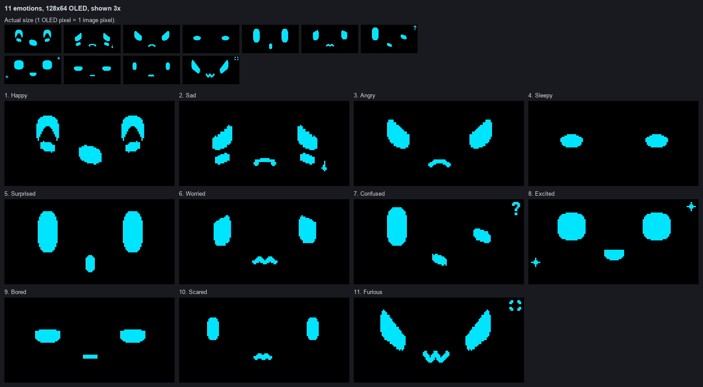

<div align="center">


<samp><b>OLED EYE ANIMATION</b></samp>

<samp>esp32 · ssd1306 · arduino · embedded systems</samp>

</div>

---

<div align="center"><samp>An ESP32-based OLED project with an animated robot face, mood-driven Eye Mode with button reactions, two-button control, and empty media slots ready for future content.</samp></div>

---

<div align="center"><samp><b>Project Overview</b></samp></div>

<samp>The sketch drives a 128×64 SSD1306 OLED from an ESP32 and has two modes. Normal Mode steps through 5 video slots and 5 image slots, which are intentionally empty for now. Eye Mode shows a robot face that switches automatically between 11 animated emotions.</samp>

<samp>Every emotion is drawn live from one curved eye shape. No per-frame bitmaps are used, and all timing is non-blocking, so the buttons stay responsive while the face animates.</samp>

<samp>The project provides practical experience with:</samp>

- <samp>Embedded systems</samp>
- <samp>OLED graphics with Adafruit GFX</samp>
- <samp>Procedural animation</samp>
- <samp>Button debouncing and input handling</samp>
- <samp>Non-blocking timing with <code>millis()</code></samp>

---

<div align="center"><samp><b>Features</b></samp></div>

- <samp><b>Animated robot face</b> — 11 emotions drawn live with Adafruit GFX, with emotion-specific animation.</samp>
- <samp><b>Eye Mode</b> — automatic mood-weighted emotion selection without repeating the same emotion twice in a row.</samp>
- <samp><b>Button reactions</b> — PREV/NEXT presses can trigger reactions for Happy and Sad after a random 1–5 click threshold.</samp>
- <samp><b>Two-button mode switching</b> — PREV and NEXT browse media in Normal Mode; both together switch modes.</samp>
- <samp><b>Future-ready media slots</b> — 5 video slots and 5 image slots are present and currently empty.</samp>
- <samp><b>Non-blocking animation</b> — timing is handled with <code>millis()</code> so input remains responsive.</samp>

---

<div align="center"><samp><b>Hardware</b></samp></div>

| <samp>Part</samp> | <samp>Connection</samp> | <samp>ESP32</samp> |
|---|---|---|
| <samp>SSD1306 OLED 128×64</samp> | <samp>VCC</samp> | <samp>3V3</samp> |
| <samp>SSD1306 OLED 128×64</samp> | <samp>GND</samp> | <samp>GND</samp> |
| <samp>SSD1306 OLED 128×64</samp> | <samp>SDA</samp> | <samp>GPIO 22</samp> |
| <samp>SSD1306 OLED 128×64</samp> | <samp>SCL</samp> | <samp>GPIO 21</samp> |
| <samp>PREV button</samp> | <samp>one leg</samp> | <samp>GPIO 25</samp> |
| <samp>PREV button</samp> | <samp>other leg</samp> | <samp>GND</samp> |
| <samp>NEXT button</samp> | <samp>one leg</samp> | <samp>GPIO 26</samp> |
| <samp>NEXT button</samp> | <samp>other leg</samp> | <samp>GND</samp> |

<samp><b>OLED address:</b> <code>0x3C</code>. Buttons use <code>INPUT_PULLUP</code>, so a pressed button reads <code>LOW</code>. This project intentionally uses <code>SDA = GPIO 22</code> and <code>SCL = GPIO 21</code> through <code>Wire.begin(22, 21)</code>.</samp>

---

<div align="center"><samp><b>Modes</b></samp></div>

<samp><b>Normal Mode</b></samp>

- <samp>Starts on Video slot 1.</samp>
- <samp>PREV and NEXT browse 5 video slots and 5 image slots.</samp>
- <samp>The 10 media slots are currently empty and display <code>Slot N: not loaded</code>.</samp>

<samp><b>Eye Mode</b></samp>

- <samp>Press PREV + NEXT together to enter.</samp>
- <samp>One of 11 emotions is selected immediately using weighted randomness.</samp>
- <samp>The emotion animates continuously at about 30 FPS (one frame every 33 ms).</samp>
- <samp>After a randomized interval, another emotion is selected.</samp>
- <samp>The same emotion is never selected twice in a row.</samp>
- <samp>Single PREV/NEXT presses become reaction clicks instead of changing the emotion.</samp>

<samp><b>Exit</b></samp>

- <samp>Press both buttons together again to return to the same media slot shown before Eye Mode.</samp>

---

<div align="center"><samp><b>Emotions</b></samp></div>

| <samp>#</samp> | <samp>Name</samp> | <samp>Weight</samp> | <samp>Time</samp> |
|---:|---|---:|---|
| <samp>1</samp> | <samp>Happy</samp> | <samp>14</samp> | <samp>4–8 s</samp> |
| <samp>2</samp> | <samp>Sad</samp> | <samp>3</samp> | <samp>5–8 s</samp> |
| <samp>3</samp> | <samp>Angry</samp> | <samp>4</samp> | <samp>3.5–6 s</samp> |
| <samp>4</samp> | <samp>Sleepy</samp> | <samp>5</samp> | <samp>6–10 s</samp> |
| <samp>5</samp> | <samp>Surprised</samp> | <samp>2</samp> | <samp>2.5–4.5 s</samp> |
| <samp>6</samp> | <samp>Worried</samp> | <samp>3</samp> | <samp>4–7 s</samp> |
| <samp>7</samp> | <samp>Confused</samp> | <samp>5</samp> | <samp>4–7 s</samp> |
| <samp>8</samp> | <samp>Excited</samp> | <samp>8</samp> | <samp>3–6 s</samp> |
| <samp>9</samp> | <samp>Bored</samp> | <samp>5</samp> | <samp>5–9 s</samp> |
| <samp>10</samp> | <samp>Scared</samp> | <samp>2</samp> | <samp>3–5 s</samp> |
| <samp>11</samp> | <samp>Furious</samp> | <samp>2</samp> | <samp>3–5 s</samp> |

<samp>The weights total 53. Higher values make an emotion more likely to be selected before the no-repeat rule.</samp>

---

<div align="center"><samp><b>Eye Design</b></samp></div>

- <samp>One curved eye shape (<code>rfEye()</code>): a superellipse between an oval and a rounded rectangle, with slightly flattened top and bottom and never a perfect circle.</samp>
- <samp>Emotions deform that same shape: stretched, squashed, tilted, or cut by curved upper and lower lids.</samp>
- <samp>The whole face is drawn at 140% of the base design (<code>RF_SCALE</code>), with eyes kept narrow at 72% width (<code>RF_EYE_NARROW</code>).</samp>
- <samp>Small extras such as mouths, a tear, "z", "?", sparkles, and an anger mark are drawn with the same integer math.</samp>
- <samp>Design reference: the eye style was inspired by this <a href="https://www.oledanimationmaker.com/?s=DBdtgyEY6vSbQFSxpzuu">OLED Animation Maker design</a>; the implementation in <code>EyeVariants.h</code> is original.</samp>

---

<div align="center"><samp><b>Reactions</b></samp></div>

<samp>In Eye Mode, every PREV/NEXT press increments a shared click counter. A random threshold from 1–5 clicks is selected when Eye Mode starts and after each reaction or reset.</samp>

| <samp>Emotion</samp> | <samp>Implemented reaction</samp> |
|---|---|
| <samp>Happy</samp> | <samp><b>I lovee youhhh!</b> / <b>Mwahhh mwahh mwahhh</b></samp> |
| <samp>Sad</samp> | <samp><b>I miss youhh!</b></samp> |

- <samp>The screen turns white and the message is typed in bold black text, one character about every 70 ms.</samp>
- <samp>The message is held for about 1.6 s, then the same emotion resumes without a new selection.</samp>
- <samp>Presses during a reaction are ignored; both buttons still exit Eye Mode.</samp>
- <samp>Other emotions reset the reaction counter when the threshold is reached but show no text.</samp>

---

<div align="center"><samp><b>Previews</b></samp></div>




<div align="center"><samp>These previews are rendered from the same shapes and integer drawing logic used by <code>EyeVariants.h</code>.</samp></div>

---

<div align="center"><samp><b>Button Behavior</b></samp></div>

| <samp>Input</samp> | <samp>Normal Mode</samp> | <samp>Eye Mode</samp> |
|---|---|---|
| <samp>PREV</samp> | <samp>Previous media slot</samp> | <samp>Reaction click</samp> |
| <samp>NEXT</samp> | <samp>Next media slot</samp> | <samp>Reaction click</samp> |
| <samp>PREV + NEXT</samp> | <samp>Enter Eye Mode</samp> | <samp>Exit to the same media slot</samp> |

<samp><b>Debounce:</b> 30 ms stable input.</samp>

<samp><b>Combination window:</b> up to 80 ms for detecting simultaneous presses.</samp>

<samp><b>Single-button repeat:</b> one PREV/NEXT action every 200 ms at most.</samp>

<samp>Holding both buttons switches mode only once until both are released.</samp>

---

<div align="center"><samp><b>Software</b></samp></div>

| <samp>Software</samp> | <samp>Purpose</samp> |
|---|---|
| <samp>Arduino IDE</samp> | <samp>Sketch development and upload</samp> |
| <samp>ESP32 Arduino core 2.0.17</samp> | <samp>ESP32 runtime and board support</samp> |
| <samp>Adafruit SSD1306</samp> | <samp>OLED driver</samp> |
| <samp>Adafruit GFX Library</samp> | <samp>Drawing and rendering</samp> |
| <samp>Adafruit BusIO</samp> | <samp>Adafruit library dependency</samp> |
| <samp>Wire</samp> | <samp>I2C communication</samp> |

<samp>The included <code>esp32-eyes-main/</code> directory is reference material only. It is not compiled or linked by this project.</samp>

---

<div align="center"><samp><b>Project Structure</b></samp></div>

```text
OLED_Eye_Animation/
├── OLED_Eye_Animation.ino         Main sketch: media slots, modes, buttons, reactions
├── EyeVariants.h                  11 emotions, geometry, drawing and animation
├── README.md                      Project documentation
├── docs/
│   ├── eye-emotions-sheet.png     Emotion preview sheet
│   └── eye-mode-preview.gif       Animated emotion preview
└── esp32-eyes-main/               Reference copy of esp32-eyes (not compiled)
```

<samp>The 5 video slots and 5 image slots are intentionally empty. Future media data is designed to be inserted into <code>OLED_Eye_Animation.ino</code> at the marked placeholders.</samp>

---

<div align="center"><samp><b>Installation</b></samp></div>

<samp><b>1. Clone the repository</b></samp>

```bash
git clone https://github.com/yo5on/oled-project.git OLED_Eye_Animation
```

<samp>The Arduino IDE requires the sketch folder name to match the <code>.ino</code> filename. Cloning into <code>OLED_Eye_Animation</code> keeps <code>OLED_Eye_Animation.ino</code> in a matching folder.</samp>

<samp><b>2. Open the sketch</b></samp>

<samp>Open <code>OLED_Eye_Animation/OLED_Eye_Animation.ino</code> in Arduino IDE and keep <code>EyeVariants.h</code> beside it.</samp>

<samp><b>3. Install ESP32 support</b></samp>

<samp>Install <b>esp32 by Espressif Systems</b> through Boards Manager.</samp>

<samp><b>4. Install libraries</b></samp>

<samp>Install <b>Adafruit SSD1306</b> through Library Manager and accept the required dependencies.</samp>

<samp><b>5. Select the board</b></samp>

<samp><b>Tools → Board → esp32 → ESP32 Dev Module</b></samp>

<samp><b>6. Select the port</b></samp>

<samp>Choose the COM port connected to the ESP32.</samp>

<samp><b>7. Upload</b></samp>

<samp>If upload stalls at <code>Connecting...</code>, hold the board's <b>BOOT</b> button while the upload starts.</samp>

<samp><b>8. Test</b></samp>

- <samp>Open Serial Monitor at <b>115200</b> baud and check for <code>OLED READY</code>.</samp>
- <samp>Press PREV/NEXT and confirm media-slot navigation.</samp>
- <samp>Press both buttons together and check for <code>EYE MODE</code>.</samp>
- <samp>Use PREV/NEXT in Eye Mode and verify the reaction logic.</samp>

---

<div align="center"><samp><b>Usage</b></samp></div>

1. <samp>Power on. Normal Mode starts on Video slot 1.</samp>
2. <samp>Use PREV/NEXT to browse the 5 video and 5 image slots.</samp>
3. <samp>Press both buttons to enter Eye Mode.</samp>
4. <samp>Watch the emotion animate and change automatically.</samp>
5. <samp>Press PREV/NEXT to trigger the reaction counter.</samp>
6. <samp>Press both buttons again to return to the previous media slot.</samp>

---

<div align="center"><samp><b>Current Content</b></samp></div>

| <samp>Content</samp> | <samp>Count</samp> | <samp>Status</samp> |
|---|---:|---|
| <samp>Video slots</samp> | <samp>5</samp> | <samp>Empty</samp> |
| <samp>Image slots</samp> | <samp>5</samp> | <samp>Empty</samp> |
| <samp>Emotions</samp> | <samp>11</samp> | <samp>Implemented</samp> |

<samp><b>Normal Mode order:</b> <code>Video 1 → Video 2 → Video 3 → Video 4 → Video 5 → Image 1 → Image 2 → Image 3 → Image 4 → Image 5</code></samp>

---

<div align="center"><samp><b>OLED Animation Maker</b></samp></div>

<samp>Want to create your own OLED animations? You can use <a href="https://www.oledanimationmaker.com/">OLED Animation Maker</a> to create and customize animations, import visual content, preview them, and generate Arduino-ready animation data/code for OLED projects.</samp>

<samp>This project can be extended with custom animations created using the tool. Generated 128×64 bitmap data can be pasted into the empty video and image slots in <code>OLED_Eye_Animation.ino</code>.</samp>

<div align="center"><samp>🔗 <a href="https://www.oledanimationmaker.com/">https://www.oledanimationmaker.com/</a></samp></div>

---

<div align="center"><samp><b>Development Notes</b></samp></div>

| <samp>Area</samp> | <samp>Implementation</samp> |
|---|---|
| <samp>Pins and OLED</samp> | <samp><code>OLED_Eye_Animation.ino</code>: <code>BTN_PREV</code>, <code>BTN_NEXT</code>, <code>SCREEN_ADDR</code>, <code>Wire.begin(22, 21)</code></samp> |
| <samp>Content</samp> | <samp><code>contents[]</code> and <code>videoFrameMs[]</code></samp> |
| <samp>Navigation</samp> | <samp><code>nextContent()</code>, <code>previousContent()</code>, <code>playContent()</code></samp> |
| <samp>Emotions</samp> | <samp><code>EyeVariantId</code>, <code>eyeVariants[]</code>, <code>rfDrawEmotion()</code></samp> |
| <samp>Geometry</samp> | <samp><code>rfEye()</code>, <code>rfLids()</code>, <code>rfArc()</code>, <code>rfStroke()</code></samp> |
| <samp>Animation</samp> | <samp><code>drawEyeFrame()</code>, <code>eyeAnimRestart()</code>, <code>eyeAnimUpdate()</code></samp> |
| <samp>Mood selection</samp> | <samp><code>eyeMoods[]</code>, <code>pickRandomEye()</code>, <code>autoSelectEye()</code></samp> |
| <samp>Reactions</samp> | <samp><code>handleEyeModePress()</code>, <code>newReactThreshold()</code>, <code>startReaction()</code>, <code>drawReaction()</code>, <code>updateReaction()</code></samp> |
| <samp>Modes</samp> | <samp><code>Mode</code>, <code>enterEyeMode()</code>, <code>exitEyeMode()</code>, <code>loop()</code></samp> |
| <samp>Buttons</samp> | <samp><code>DebouncedButton</code>, <code>updateButton()</code>, <code>handleButtons()</code></samp> |

<samp>When adding or removing an emotion, keep <code>EyeVariantId</code>, <code>eyeVariants[]</code>, the corresponding <code>rfDrawEmotion()</code> case, <code>eyeMoods[]</code>, and the <code>EYES</code> slots aligned.</samp>

---

<div align="center"><samp><b>Author</b></samp></div>

<div align="center">
<samp><strong>Yoson</strong></samp>

<samp>Embedded systems, robotics, and hardware projects.</samp>

<samp>GitHub: https://github.com/yo5on</samp>
</div>

---

<div align="center"><samp><b>License</b></samp></div>

<samp>The current robot-face graphics and animations in <code>EyeVariants.h</code> are original to this project. The style was inspired by a design made with <a href="https://www.oledanimationmaker.com/?s=DBdtgyEY6vSbQFSxpzuu">OLED Animation Maker</a>. An earlier implementation was derived from <a href="https://github.com/playfultechnology/esp32-eyes">esp32-eyes</a> by Alastair Aitchison (Playful Technology) and Luis Llamas under AGPL-3.0; that reference source remains in <code>esp32-eyes-main/</code> with its license.</samp>

<div align="center"><samp>If you find this project useful, consider giving the repository a star.</samp></div>
