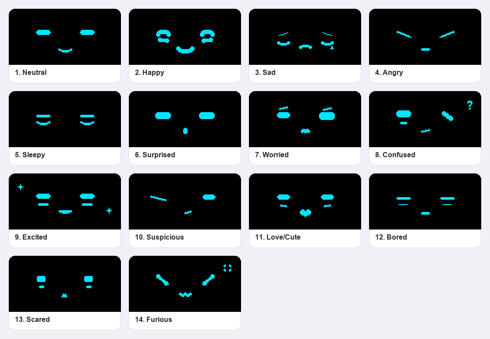
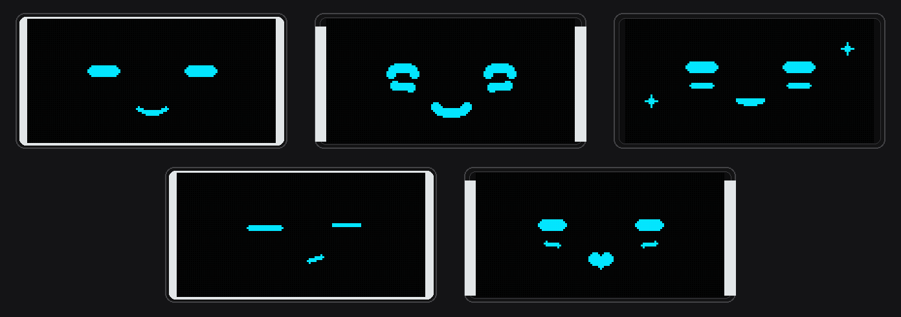

<div align="center">


<samp><b>OLED EYE ANIMATION</b></samp>

<samp>esp32 · ssd1306 · arduino · embedded systems</samp>

</div>

---

<div align="center"><samp>An ESP32-based OLED eye animation system with videos, still images, expressive animated eyes, mood-driven Eye Mode, and two-button control.</samp></div>

---

<div align="center"><samp><b>Features</b></samp></div>

- <samp><b>Video and image playback</b> — 4 animated videos stored as bitmap frames and 6 still images.</samp>
- <samp><b>Animated robot-eye expressions</b> — 14 original cyan-style pixel/LED designs drawn live with Adafruit GFX geometry.</samp>
- <samp><b>Eye Mode</b> — autonomous, mood-based expression selection with weighted randomness and timed transitions.</samp>
- <samp><b>Two-button control</b> — PREV and NEXT navigate content in Normal Mode, while both buttons switch between modes.</samp>
- <samp><b>Responsive animation</b> — non-blocking <code>millis()</code>-based timing keeps buttons responsive while content animates.</samp>

---

<div align="center"><samp><b>Hardware</b></samp></div>

| <samp>Part</samp> | <samp>Connection</samp> | <samp>ESP32</samp> |
|---|---|---|
| <samp>SSD1306 OLED</samp> | <samp>VCC</samp> | <samp>3V3</samp> |
| <samp>SSD1306 OLED</samp> | <samp>GND</samp> | <samp>GND</samp> |
| <samp>SSD1306 OLED</samp> | <samp>SDA</samp> | <samp>GPIO 22</samp> |
| <samp>SSD1306 OLED</samp> | <samp>SCL</samp> | <samp>GPIO 21</samp> |
| <samp>PREV button</samp> | <samp>one leg</samp> | <samp>GPIO 25</samp> |
| <samp>PREV button</samp> | <samp>other leg</samp> | <samp>GND</samp> |
| <samp>NEXT button</samp> | <samp>one leg</samp> | <samp>GPIO 26</samp> |
| <samp>NEXT button</samp> | <samp>other leg</samp> | <samp>GND</samp> |

<samp><b>OLED address:</b> <code>0x3C</code>. Buttons use <code>INPUT_PULLUP</code>, so a pressed button reads <code>LOW</code>. This project intentionally uses <code>SDA = GPIO 22</code> and <code>SCL = GPIO 21</code> via <code>Wire.begin(22, 21)</code>.</samp>

---

<div align="center"><samp><b>Modes</b></samp></div>

<samp><b>Normal Mode</b></samp>

- <samp>Starts with the first video.</samp>
- <samp>PREV and NEXT browse the 4 videos and 6 images.</samp>
- <samp>Videos loop continuously at their configured frame rate.</samp>
- <samp>Images remain on screen until navigation changes the item.</samp>

<samp><b>Eye Mode</b></samp>

- <samp>Press PREV and NEXT together to enter.</samp>
- <samp>An expression is selected immediately using the mood weights.</samp>
- <samp>The selected expression animates at about 30 FPS.</samp>
- <samp>After a randomized interval, another expression is selected.</samp>
- <samp>The same expression is never selected twice in a row.</samp>
- <samp>Single PREV/NEXT presses are ignored in Eye Mode.</samp>

<samp><b>Exit</b></samp>

- <samp>Press both buttons together again to return to the exact video or image that was previously displayed.</samp>
- <samp>If a video was playing, it resumes from its previous frame.</samp>

---

<div align="center"><samp><b>Eye Expressions</b></samp></div>

| <samp>#</samp> | <samp>Name</samp> | <samp>Distinct geometry and animation</samp> | <samp>Weight</samp> | <samp>Time</samp> |
|---:|---|---|---:|---|
| <samp>1</samp> | <samp>Neutral</samp> | <samp>Long, thin rounded LED bars breathe, glance, and blink into slits</samp> | <samp>20</samp> | <samp>5–10 s</samp> |
| <samp>2</samp> | <samp>Happy</samp> | <samp>Arc-shaped eyes and cheek bars bounce with a pulsing smile</samp> | <samp>14</samp> | <samp>4–8 s</samp> |
| <samp>3</samp> | <samp>Sad</samp> | <samp>Drooping diagonal capsules, lower curves, a falling tear, and a frown</samp> | <samp>3</samp> | <samp>5–8 s</samp> |
| <samp>4</samp> | <samp>Angry</samp> | <samp>Thick sharp wedges point down toward the centre, tighten, and tremble</samp> | <samp>4</samp> | <samp>3.5–6 s</samp> |
| <samp>5</samp> | <samp>Sleepy</samp> | <samp>Heavy lids close slowly; a floating z and snore appear</samp> | <samp>5</samp> | <samp>6–10 s</samp> |
| <samp>6</samp> | <samp>Surprised</samp> | <samp>Long thin eyes rapidly widen and overshoot; tiny open mouth</samp> | <samp>2</samp> | <samp>2.5–4.5 s</samp> |
| <samp>7</samp> | <samp>Worried</samp> | <samp>Unequal long eyes and tilted brows bob independently over a nervous mouth</samp> | <samp>3</samp> | <samp>4–7 s</samp> |
| <samp>8</samp> | <samp>Confused</samp> | <samp>One long eye grows while the other rocks as a slit; ? bobs</samp> | <samp>5</samp> | <samp>4–7 s</samp> |
| <samp>9</samp> | <samp>Excited</samp> | <samp>Wide thin LED bars bounce and flash sparkles around an open grin</samp> | <samp>8</samp> | <samp>3–6 s</samp> |
| <samp>10</samp> | <samp>Suspicious</samp> | <samp>One narrow slit and one open eye shift beside a smirk</samp> | <samp>5</samp> | <samp>4–7 s</samp> |
| <samp>11</samp> | <samp>Love/Cute</samp> | <samp>Long rounded eyes squint, small lower pieces sway, heart beats twice</samp> | <samp>6</samp> | <samp>4–7 s</samp> |
| <samp>12</samp> | <samp>Bored</samp> | <samp>Extremely flat eyelid strokes drift slowly and blink lazily</samp> | <samp>5</samp> | <samp>5–9 s</samp> |
| <samp>13</samp> | <samp>Scared</samp> | <samp>Small thin capsules tremble, pulse, and dart with empty space around them</samp> | <samp>2</samp> | <samp>3–5 s</samp> |
| <samp>14</samp> | <samp>Furious</samp> | <samp>Thick sharp slashes shake around a flashing anger mark</samp> | <samp>2</samp> | <samp>3–5 s</samp> |

<samp>Weights total 84. Higher values make an emotion more likely before the no-repeat rule is applied. Animation periods differ by emotion, from the 0.42 s Excited bounce to the 5.2 s Sleepy doze cycle.</samp>

---

<div align="center"><samp><b>Eye Mode Preview</b></samp></div>






<div align="center"><samp>The GIF displays one native 128×64 frame at a time. The emotion gallery uses a light rounded-card UI; each black screen is enlarged exactly 2× with nearest-neighbour scaling, preserving the OLED's 2:1 pixel layout. The emotion drawings are unchanged by the gallery restyle. The software rasterizer mirrors the geometry and timing in <code>EyeVariants.h</code>.</samp></div>

---

<div align="center"><samp><b>Button Behavior</b></samp></div>

| <samp>Input</samp> | <samp>Normal Mode</samp> | <samp>Eye Mode</samp> |
|---|---|---|
| <samp>PREV</samp> | <samp>Previous video/image</samp> | <samp>Ignored</samp> |
| <samp>NEXT</samp> | <samp>Next video/image</samp> | <samp>Ignored</samp> |
| <samp>PREV + NEXT</samp> | <samp>Enter Eye Mode</samp> | <samp>Exit to the same video/image</samp> |

<samp><b>Debounce:</b> 30 ms stable input.</samp>

<samp><b>Combination window:</b> up to 80 ms for detecting a simultaneous press.</samp>

<samp><b>Single-button repeat:</b> a single PREV/NEXT action is limited to at most one action every 200 ms.</samp>

<samp>Holding both buttons switches mode only once and does not trigger repeated mode changes until both buttons are released.</samp>

---

<div align="center"><samp><b>Software</b></samp></div>

- <samp>Arduino IDE</samp>
- <samp>ESP32 Arduino core — checked against version 2.0.17</samp>
- <samp>Adafruit SSD1306</samp>
- <samp>Adafruit GFX Library</samp>
- <samp>Adafruit BusIO</samp>
- <samp>Wire / I2C</samp>

<samp>The project uses Adafruit GFX for drawing. The <code>esp32-eyes</code> library is included only as reference; the robot-face geometry and animation code in <code>EyeVariants.h</code> is original and does not compile or link that library.</samp>

---

<div align="center"><samp><b>Project Structure</b></samp></div>

```text
oled-project/
├── v3.ino                     Existing sketch, unchanged
├── EyeVariants.h              Existing v3 eye system, unchanged
├── README.md                  Existing v3 documentation, unchanged
├── docs/                      Existing v3 preview assets, unchanged
├── esp32-eyes-main/           Reference copy of esp32-eyes
└── v4/
    ├── v4.ino                 Separate sketch, content data, modes, buttons
    ├── EyeVariants.h          Original v4 eye geometry and animation
    ├── README.md              v4 documentation
    ├── docs/
    │   ├── eye-mode-preview.gif   Native-size animated OLED preview
    │   ├── eye-emotions-sheet.png 14 emotions in 2x OLED cards
    │   └── eye-style-reference.png Five OLED-style examples
    └── tools/
        └── render_eye_previews.py Preview renderer
```

<samp>All video and image bitmap data is stored in <code>v4.ino</code> as <code>PROGMEM</code> arrays. There are no separate content files.</samp>

---

<div align="center"><samp><b>Installation</b></samp></div>

<samp><b>1. Get the code</b></samp>

```bash
git clone https://github.com/yo5on/oled-project.git oled-project
```

<samp>The sketch is in the <code>v4</code> folder, whose name matches the <code>v4.ino</code> filename as required by Arduino IDE.</samp>

<samp><b>2. Open the sketch</b></samp>

<samp>Open <code>v4/v4.ino</code> in Arduino IDE. <code>EyeVariants.h</code> is beside the sketch so the quoted include resolves.</samp>

<samp><b>3. Install ESP32 support</b></samp>

<samp>Use Boards Manager to install <b>esp32 by Espressif Systems</b>.</samp>

<samp><b>4. Install libraries</b></samp>

<samp>Use Library Manager to install <b>Adafruit SSD1306</b> and its dependencies.</samp>

<samp><b>5. Select the board</b></samp>

<samp><b>Tools → Board → esp32 → ESP32 Dev Module</b></samp>

<samp><b>6. Select the port</b></samp>

<samp>Choose the COM port connected to the ESP32.</samp>

<samp><b>7. Upload</b></samp>

<samp>If upload stalls at <code>Connecting...</code>, hold the board's <b>BOOT</b> button while the upload starts.</samp>

<samp><b>8. Test</b></samp>

- <samp>Open Serial Monitor at <b>115200</b> baud and check for <code>OLED READY</code>.</samp>
- <samp>Press NEXT and PREV to verify content navigation.</samp>
- <samp>Press both buttons together and check for <code>EYE MODE</code>.</samp>

---

<div align="center"><samp><b>Usage</b></samp></div>

1. <samp>Power on. Normal Mode starts on Video 1.</samp>
2. <samp>Use PREV/NEXT to cycle through 4 videos and 6 images.</samp>
3. <samp>Press both buttons to enter Eye Mode.</samp>
4. <samp>Watch the selected eye expression animate and transition automatically.</samp>
5. <samp>Press both buttons again to return to the same video or image.</samp>

---

<div align="center"><samp><b>Current Content</b></samp></div>

| <samp>Content</samp> | <samp>Count</samp> | <samp>Defined in</samp> |
|---|---:|---|
| <samp>Videos</samp> | <samp>4</samp> | <samp><code>v4.ino</code>, <code>contents[]</code></samp> |
| <samp>Images</samp> | <samp>6</samp> | <samp><code>v4.ino</code>, <code>contents[]</code></samp> |
| <samp>Eye variants</samp> | <samp>14</samp> | <samp><code>EyeVariants.h</code></samp> |

<samp><b>Normal Mode order:</b> <code>video1 → video4 → video3 → video2 → image1 → image2 → image3 → image4 → image5 → image7</code></samp>

| <samp>Video</samp> | <samp>Frame time</samp> | <samp>Approx. FPS</samp> |
|---|---:|---:|
| <samp><code>video1</code></samp> | <samp>91 ms</samp> | <samp>~11</samp> |
| <samp><code>video4</code></samp> | <samp>66 ms</samp> | <samp>~15</samp> |
| <samp><code>video3</code></samp> | <samp>149 ms</samp> | <samp>~6.7</samp> |
| <samp><code>video2</code></samp> | <samp>200 ms</samp> | <samp>5</samp> |

---

<div align="center"><samp><b>Troubleshooting</b></samp></div>

| <samp>Problem</samp> | <samp>What to check</samp> |
|---|---|
| <samp>OLED stays blank</samp> | <samp>Verify SDA = GPIO 22, SCL = GPIO 21, VCC = 3V3, GND = GND.</samp> |
| <samp>SSD1306 allocation failed</samp> | <samp>Check power, wiring, and I2C address <code>0x3C</code>.</samp> |
| <samp>Wrong I2C address</samp> | <samp>The sketch uses <code>0x3C</code>. Some modules use <code>0x3D</code>.</samp> |
| <samp>Buttons do not respond</samp> | <samp>Connect each button between its GPIO and GND. Buttons use <code>INPUT_PULLUP</code>.</samp> |
| <samp>Eye Mode will not start</samp> | <samp>Press both buttons within about 80 ms of each other.</samp> |
| <samp>PREV/NEXT do nothing</samp> | <samp>Expected in Eye Mode. Press both buttons to return to Normal Mode.</samp> |
| <samp>Upload hangs at Connecting...</samp> | <samp>Hold BOOT while uploading and verify the COM port and USB cable.</samp> |
| <samp>Compile errors about missing headers</samp> | <samp>Install Adafruit SSD1306 and its dependencies, select an ESP32 board, and keep EyeVariants.h beside v4.ino.</samp> |
| <samp>Sketch too big</samp> | <samp>The bitmap data uses about 600 KB of flash. Use a larger app partition if you add more content.</samp> |

---

<div align="center"><samp><b>Development Notes</b></samp></div>

| <samp>Area</samp> | <samp>Implementation</samp> |
|---|---|
| <samp>Pins and OLED</samp> | <samp><code>v4.ino</code>: <code>BTN_PREV</code>, <code>BTN_NEXT</code>, <code>SCREEN_ADDR</code>, <code>Wire.begin(22, 21)</code></samp> |
| <samp>Content</samp> | <samp><code>contents[]</code>, <code>videoFrameMs[]</code>, and <code>PROGMEM</code> bitmap arrays</samp> |
| <samp>Normal navigation</samp> | <samp><code>nextContent()</code>, <code>previousContent()</code>, <code>playContent()</code></samp> |
| <samp>Eye variants</samp> | <samp><code>EyeVariantId</code>, <code>eyeVariants[]</code>, original GFX primitives and per-emotion geometry in <code>EyeVariants.h</code></samp> |
| <samp>Eye animation</samp> | <samp><code>rfDrawEmotion()</code>, <code>drawEyeFrame()</code>, <code>eyeAnimRestart()</code>, <code>eyeAnimUpdate()</code></samp> |
| <samp>Mood selection</samp> | <samp><code>eyeMoods[]</code>, <code>pickRandomEye()</code>, <code>autoSelectEye()</code>, <code>updateEyeAnimation()</code></samp> |
| <samp>Modes</samp> | <samp><code>Mode</code>, <code>enterEyeMode()</code>, <code>exitEyeMode()</code>, <code>loop()</code></samp> |
| <samp>Buttons</samp> | <samp><code>DebouncedButton</code>, <code>updateButton()</code>, <code>handleButtons()</code>, timing controls</samp> |

<samp>When adding or removing an eye expression, keep <code>EyeVariantId</code>, <code>eyeVariants[]</code>, <code>rfDrawEmotion()</code> cases, <code>eyeMoods[]</code>, and the EYES entries in <code>contents[]</code> in the same order and length.</samp>

---

<div align="center"><samp><b>License</b></samp></div>

<samp>The robot-face geometry and animations in <code>EyeVariants.h</code> are original to this project. <code>esp32-eyes-main/</code> remains included as reference code and is not compiled or used by the sketch; its AGPL-3.0 license is in that folder.</samp>

<div align="center"><samp><b>Author</b></samp></div>

<div align="center">
<samp><strong>Yoson</strong></samp>

<samp>Embedded systems, robotics, and hardware projects.</samp>
</div>
